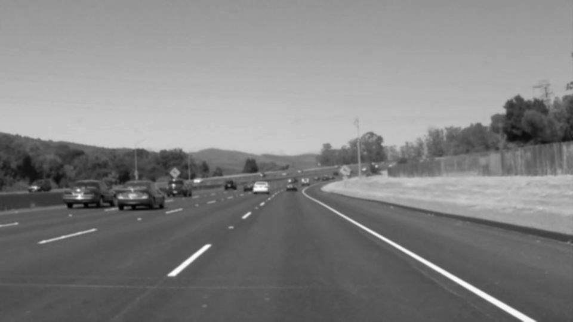
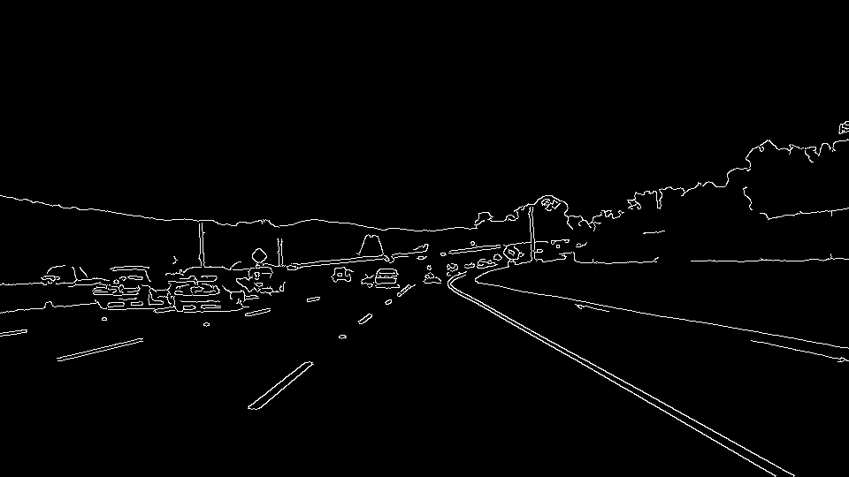
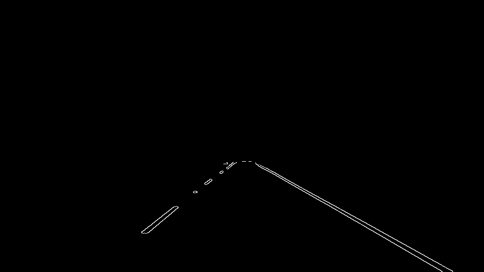
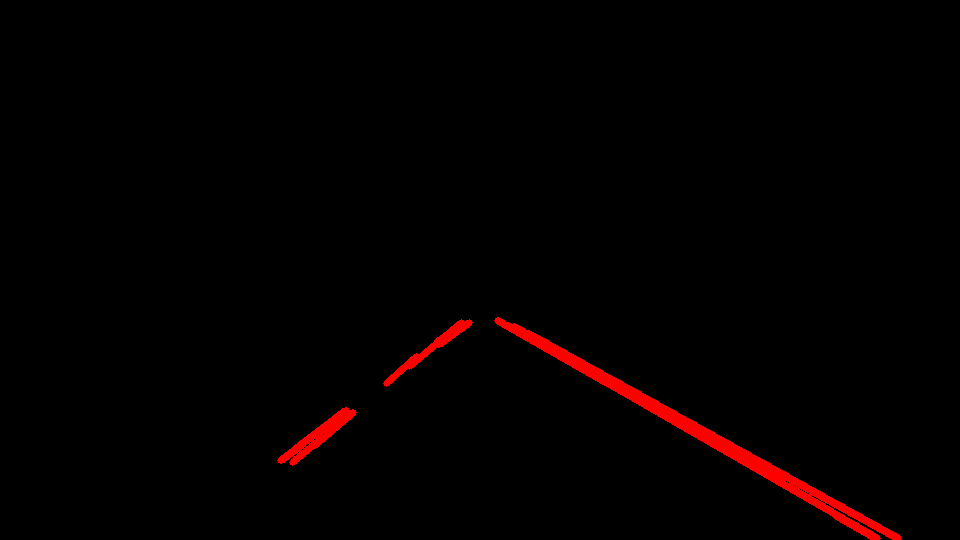
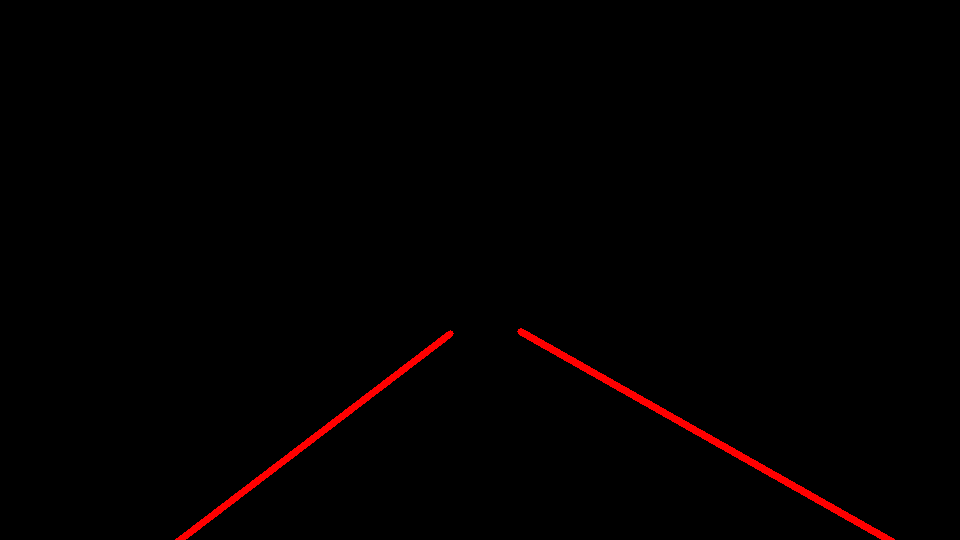
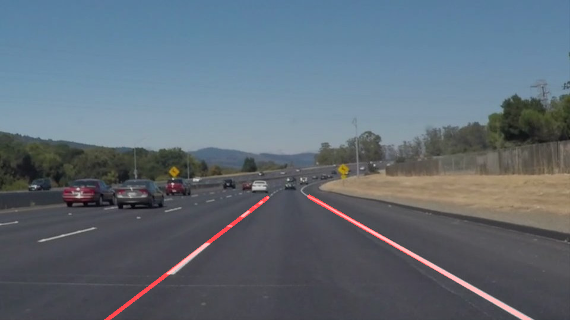

# **Finding Lane Lines on the Road** 

The goals / steps of this project are the following:
* Make a pipeline that finds lane lines on the road
* Reflect on your work in a written report

## **Reflection**

### 1. Describe your pipeline. As part of the description, explain how you modified the draw_lines() function.

My pipeline consists of the following steps for each frame in a video stream:

1. Convert the frame to grayscale as color information is not needed for edge detection

2. Apply a gaussian blur to smooth the image

3. Perform Canny edge detection

4. Mask the region of interest where lane lines are expected to be

5. Perform Hough transform on the detected edges to obtain line segments

6. Extend the line segments to draw a single line:

   In order to draw a single line on the left and right lanes, I modified the draw_lines() function by sorting the line segments into left and right bins according to the slope of the segment:

    - Left bin: As the x-value increases, the y-value decreases (since the origin is at top-left of the frame) so the gradient is negative
    - Right bin: As the x-value increases, the y-value increases so the gradient is positive

   A straight line polynomial was then superimposed over the line segments for each lane with the end points of the line calculated from manually estimating the min and max x-values.

7. Overlay the lines on the original image

### 2. Identify potential shortcomings with your current pipeline

Some of the shortcomings of the current approach are highlighted when lane lines are not straight (when going round a bend), are not contrasted with the background (low light; night time) or when they are occluded.

### 3. Suggest possible improvements to your pipeline

The current approach does not work with curved lanes as it fails with the challenge video. To remedy this, it would be helpful to use a second degree polynomial for connecting line segments. Additionally, since a video is being used, information from previous frames such as the slope can be used to smooth the slope for the current frame.

Filtering the frames according to a different colour space such as HSL may also be useful to make the algorithm robust against lighting conditions.

