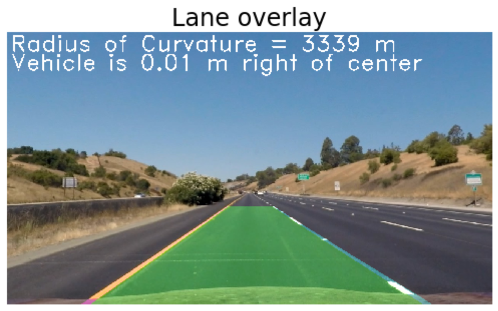

## Advanced Lane Finding

Overview
---

This project aims to find lane lines in a video stream from a mounted on the dashboard of a car. A pipeline is used to process the video stream and output a resulting video stream with the detected lane overlaid along with auxiliary information such as lane curvature and position relative to the centre of the lane. An example of the output is shown above.

Project Structure
---

- **[P2.pynb](./P2.ipynb):** Jupyter notebook containing the pipeline for finding the lanes

- **[writeup.md](./writeup.md):** Writeup of the pipeline implementation describing the steps taken to extract lane pixels and convert them to lanes

- **[test_videos_output](./test_videos_output):** Directory containing the processed test videos

- **[output_images](./output_images):** Directory containing examples of the processed test images

Running the code
---

The IPython notebook can be run using a Jupyter Notebook app such as Anaconda. The project depends on the NumPy, OpenCV, Matplotlib & MoviePy libraries.

