## Writeup- **Advanced Lane Finding Project**

---

The goals / steps of this project are the following:

* Compute the camera calibration matrix and distortion coefficients given a set of chessboard images.
* Apply a distortion correction to raw images.
* Use color transforms, gradients, etc., to create a thresholded binary image.
* Apply a perspective transform to rectify binary image ("birds-eye view").
* Detect lane pixels and fit to find the lane boundary.
* Determine the curvature of the lane and vehicle position with respect to center.
* Warp the detected lane boundaries back onto the original image.
* Output visual display of the lane boundaries and numerical estimation of lane curvature and vehicle position.

### Here I will describe how I addressed each point in my implementation.  

---

### Camera Calibration

The code for this step is contained in the second code cell of the IPython notebook located in "./P2.ipynb".  

I start by preparing "object points", which will be the (x, y, z) coordinates of the chessboard corners in the world. Here I am assuming the chessboard is fixed on the (x, y) plane at z=0, such that the object points are the same for each calibration image.  Thus, `objp` is just a replicated array of coordinates, and `objpoints` will be appended with a copy of it every time I successfully detect all chessboard corners in a test image.  `imgpoints` will be appended with the (x, y) pixel position of each of the corners in the image plane with each successful chessboard detection.  

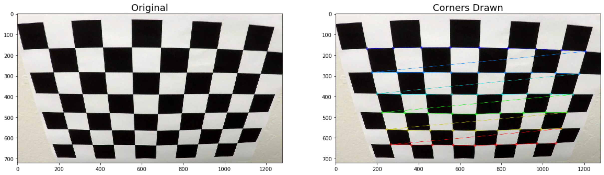

I then used the output `objpoints` and `imgpoints` to compute the camera calibration and distortion coefficients using the `cv2.calibrateCamera()` function in cell 3.  I applied this distortion correction to the test image using the `cv2.undistort()` function and obtained this result: 

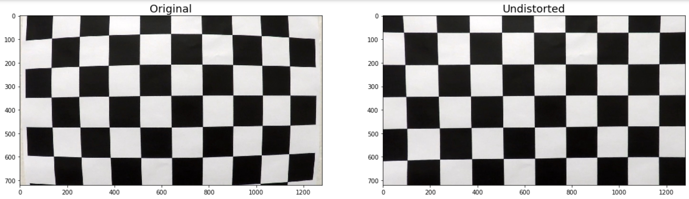

### Pipeline (single images)

#### Distortion Correction

To demonstrate this step, I will describe how I apply the distortion correction to one of the test images like this:

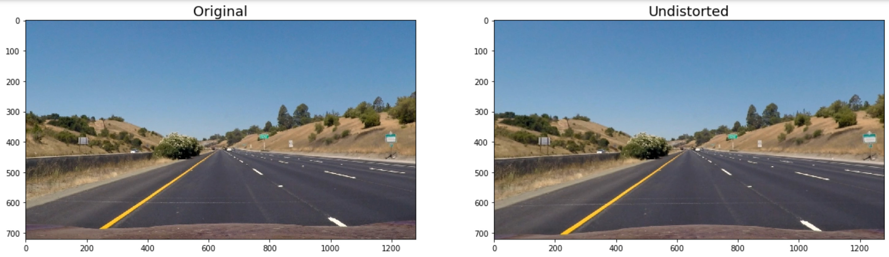

Using the computed calibration and distortion coefficients from the previous step, in a for loop, I ran each test image through the `cv2.undistort()` function to obtain a list of undistorted images as shown above. The code for this step is contained in cell 4.

#### Thresholded binary images

I used a combination of color and gradient thresholds to generate a binary image (thresholding steps at cells 6 through 12) to highlight the lane lines as much as possible while removing the background. Here's an example of my output for this step.

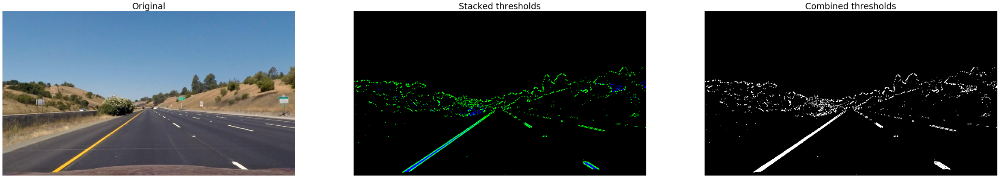

The stacked image in the center shows the contribution from the gradient thresholding in blue and the color channel in green. The image on the right is the or-combined binary image of the two thresholds. 

To create the color binary image, I explored various colour channels to visualise their distinguishing features:

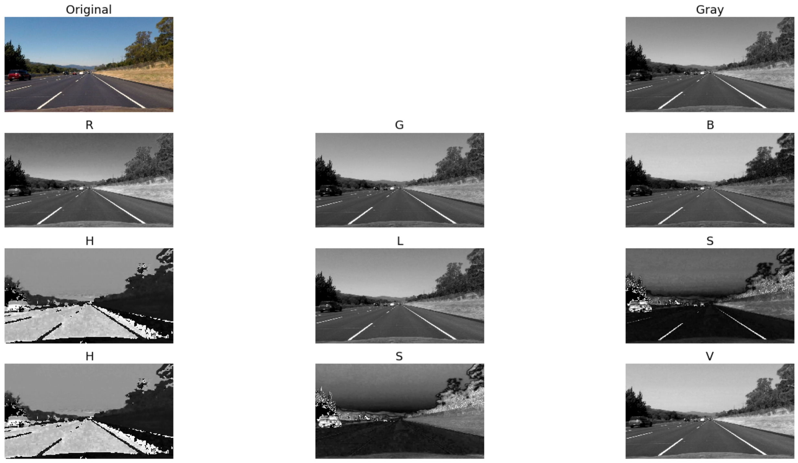

I found HLS saturation was the best at highlighting lane lines in areas covered by shadows although grayscale thresholding was able to pick up lane pixels further away:

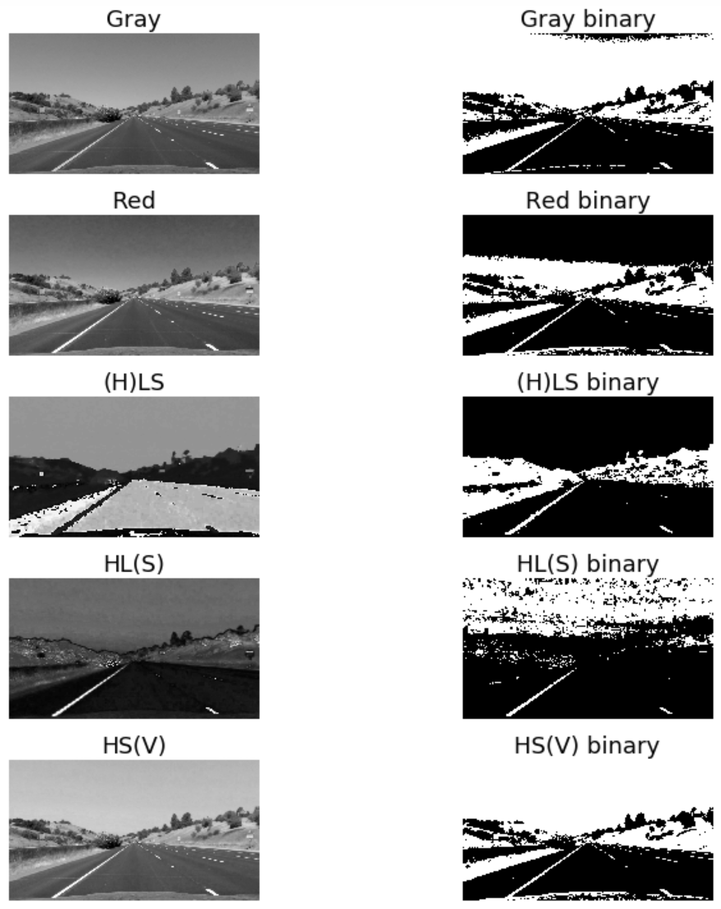

Exploring different values of thresholds showed that `(180, 255)` was the best choice, reducing the false positives from shadowy areas as much as possible:

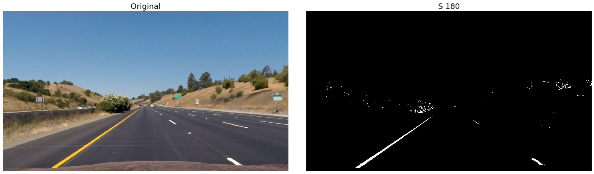

Similarly, I looked at using a combination of gradient thresholding (Sobel x, y, magintude and direction) and threshold levels (cell 9) to isolate lane pixels. 

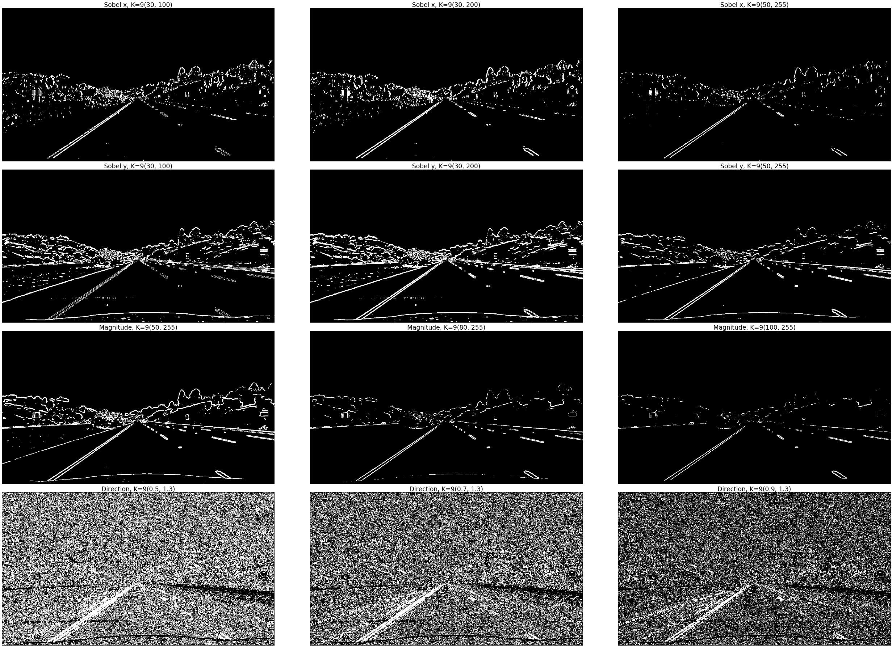

I found the optimal parameters to be: kernel size: 9, thresholds: [Gradient x & y: 50, 255, Magnitude: 80, 255, Direction: 0.7, 1.3]. These parameters work best for images without shadows and bright light where using gradient thresholding is suboptimal and should be replaced with colour thresholding.

I then combined the above using an OR operation to create a final binary image where the contribution of each thresholding technique can be visualised as shown above.

#### Perspective transform

This step aims to transform the image so that it being viewed from above as in a bird's eye-view. The resulting transform should depict the lane lines as being parallel instead of converging allowing us to measure the curvature of the lane lines.

To achieve this, in cell 13, the function `calculate_persp_transforms()` takes as input the source (`src`) and destination (`dst`) points of a user chosen image and returns the forward `perspective_M` and inverse `perspective_invM` transformation matrix for the points. The source and destination points were manually selected based on the position of lane lines in the given image.

I verified that my perspective transform was working as expected by drawing the `src` and `dst` points onto a test image and its warped counterpart to verify that the lines appear parallel in the warped image.

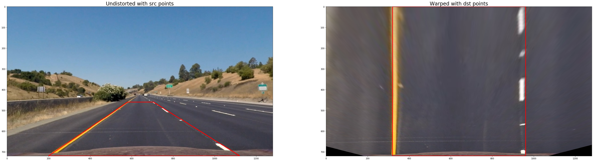

This was then used to calculate the transformed test images in cell 14.

#### Lane-line pixels and polynomial fitting

To find the lane pixels in the transformed images, the function `find_lane_pixels()` (cell 15):
* uses the peaks in the histogram of the image to identify the starting lane location
* iterates vertically across the image using a sliding window to identify all active pixels in the binary image

Having found the pixels belonging to each lane, `fit_polynomial()` fits a second order polynomial for each lane and `visualise_lane()` draws the pixels on the image with the polynomials being plotted before the image is displayed.

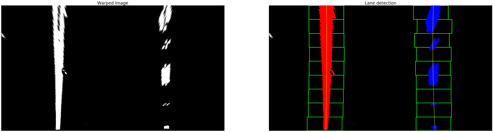

#### 5. Radius of curvature and vehicle position with respect to center.

This is calculated in cell 17. To measure the curvature, the radius is measured at the maximum-y position (closest to the vehicle)using the formula given [here](https://www.intmath.com/applications-differentiation/8-radius-curvature.php) and the polynomial calculated before. The radius is converted to real-world space (metres) by multiplying with the pixel-to-world conversion factors `xm_per_pix` and `ym_per_pix` for the x and y axis respectively. 

The final radius value is calculated as the average between the left and right lane radii and displayed on the image as shown below.

The vehicle position with respect to the center of the lane is calculated by:
* calculating the average of the x and y intercepts of the left and right lanes as the `lane_center`
* calculating the `offset` as the difference between the center of the car (assumed to be the center of the image) and `lane_center`
* the `offset` is converted to world space using the aforementioned factors

This information is then displayed on the image:

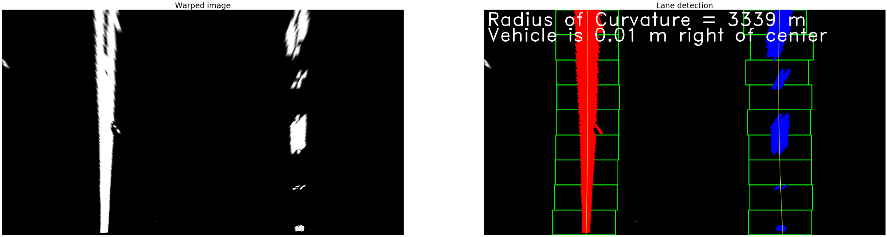

#### 6. Final result- lane overlay

This step is implemented in cell 18. A polygon and lane boundaries are generated on an empty image based on the left and right lane polynomials, warped back to the perspective of the original image using the inverse perspective matrix `perspective_invM` calculated previously and overlaid onto the original image.

Here is an example of my result on a test image:

---

### Pipeline (video)

After developing the individual steps on images, I combined them into a single step to process a video stream frame-by-frame.

To assist with this, I also created a `Line` class (cell 19) to encapsulate properties and methods for lanes. This class keeps track of information such as if a lane is currently detected, lane pixels and polynomials from previous frames etc. to make lane detection more robust.

The pipeline from image to lane overlay is implemented in cell 20. It combines the all the steps from above in a single function called `pipeline()`. To optimise the lane detection, a function called `focus_find_lane_pixels()` (cell 16) is used to target the search for lane pixels in an area around previously detected lane positions. This alleviates having to detect lanes from scratch on every frame.

In addition to this, there is some basic sanity checking included which checks to see if the detected lane lines are parallel in the top, middle and bottom of the frame. Furthermore, the lane width is measured near the car to ensure that it is 3.7m wide as per US regulations. 

To reduce the jitter in the detected lane lines, the detected positions of the lanes were smoothed by averaging the positions over the past 10 frames. 

Here's a [link to my video result](./test_videos_output/project_video.mp4)

---

### Discussion

#### 1. Briefly discuss any problems / issues you faced in your implementation of this project.  Where will your pipeline likely fail?  What could you do to make it more robust?

The biggest challenge in the implementation of this project was figuring out the correct thresholds and image channels to use so that the output was not affected by changing conditions such as lighting, tarmac colour and shadows.

The initial lane detection is rudimentary although sufficient for this project video. As it relies on gradient detection, it can fail if there is a large gradient change near the lane lines which would be incorrectly detected as a lane. It is also likely to fail in adverse weather conditions such as snow where the lane lines are the same colour as well as on areas of the road with high curvature where the road leaves the frame on the sides of the image rather than the top.

More robust detection could be achieved through improving the initial detection phase to include a check for whether the sliding windows follow the polynomial fit line especially when there are no pixels detected. More ambitious approaches could include adding confidence levels for detected lanes as well as dynamically adjusting parameters such as length of road used to detect lane and thresholds for different regions of the image.
