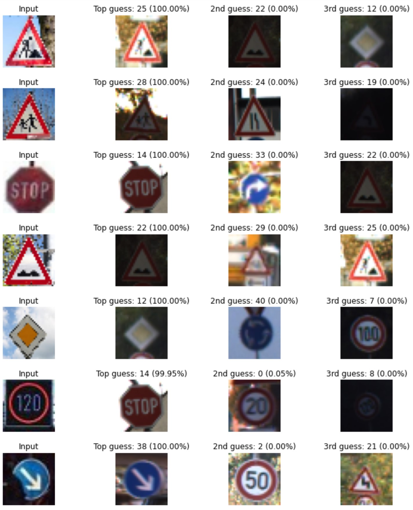

## Project: Build a Traffic Sign Recognition Program

Overview
---
This project uses deep neural networks and convolutional neural networks (CNN) to classify traffic signs. A CNN is developed, trained and validated on the [German Traffic Sign Dataset](http://benchmark.ini.rub.de/?section=gtsrb&subsection=dataset) before being tested on new images of German traffic signs in the 'wild'. An example of the output is shown above.

Project Structure
---

- **[Traffic_Sign_Classifier.pynb](./Traffic_Sign_Classifier.ipynb):** Jupyter notebook containing the development of the CNN model and results.

- **[Traffic_Sign_Classifier.html](./Traffic_Sign_Classifier.html):** Output of the notebook as a html file.

- **[writeup.md](./writeup.md):** Writeup of the implementation describing the full development cycle and subsequent training, validation and test results of the model.

### Dependencies
The IPython notebook can be run using a Jupyter Notebook app such as Anaconda. The project depends on the following libraries:
- NumPy
- Pandas
- OpenCV
- Matplotlib
- Sci-kit Learn
- Tensorflow 1.14.0

