# **Traffic Sign Recognition** 

---

**Build a Traffic Sign Recognition Project**

The goals / steps of this project are the following:
* Load the data set (see below for links to the project data set)
* Explore, summarize and visualize the data set
* Design, train and test a model architecture
* Use the model to make predictions on new images
* Analyze the softmax probabilities of the new images
* Summarize the results with a written report

---

## Data Set Summary & Exploration

### 1. Basic Summary

I used the numpy library to calculate summary statistics of the traffic signs data set:

* The size of training set is 34799
* The size of the validation set is 4410
* The size of test set is 12360
* The shape of a traffic sign image is (32, 32, 3)
* The number of unique classes/labels in the data set is 43

Some statistics on the training images:
* The minimum pixel intensity for training images is 0
* The maximum pixel intensity for training images is 255
* The mean pixel intensity for training images is 82.68

### 2. Exploratory Visualization

Here is an exploratory visualization of the data set.

Below is a preview of the visualisation for the 43 different classes in the dataset using 5 random images per class:

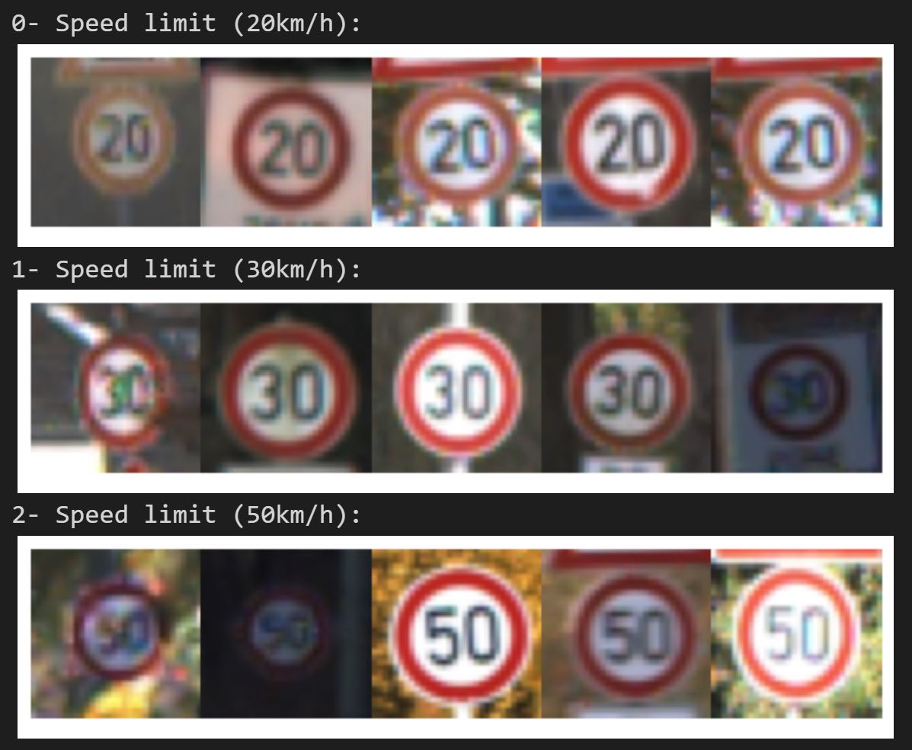

The images are not at all straightforward with rotated, blurred and very dark images such that it would be difficult for humans to recognise.

#### **Distribution**

Next, to better understand how the signs were distributed among the 43 classes, I created bar charts of each data set: training, validation and test.

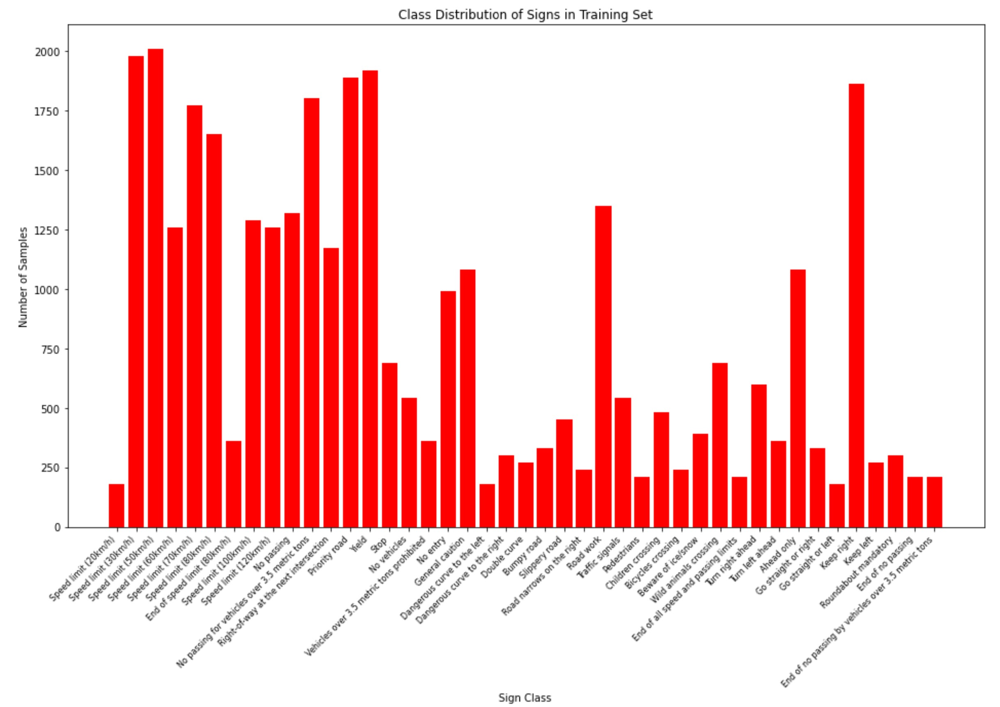

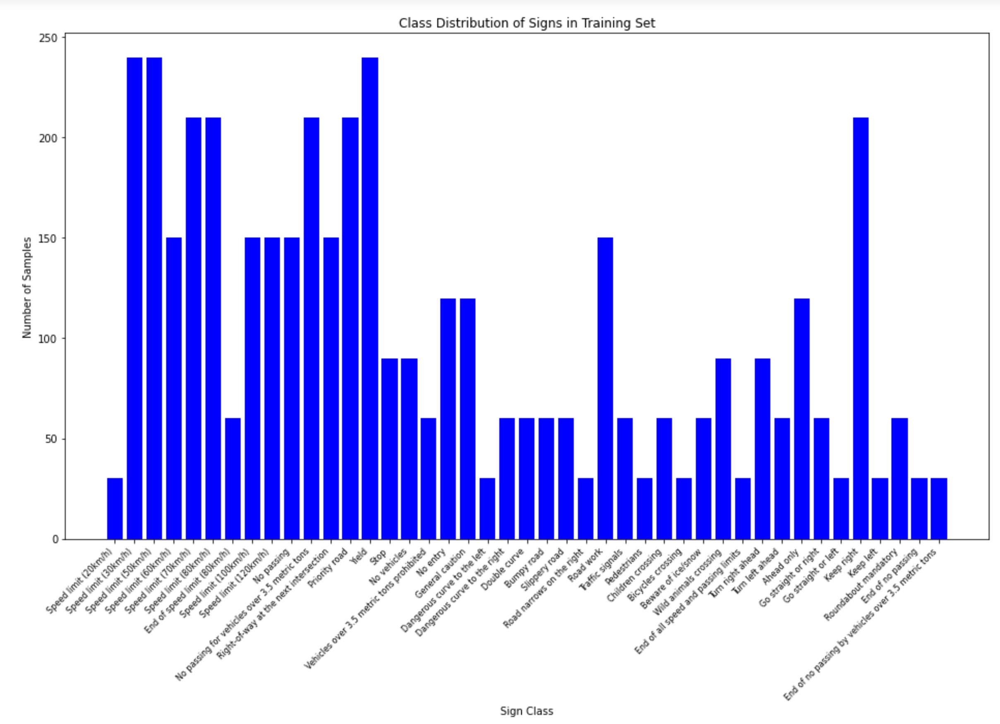

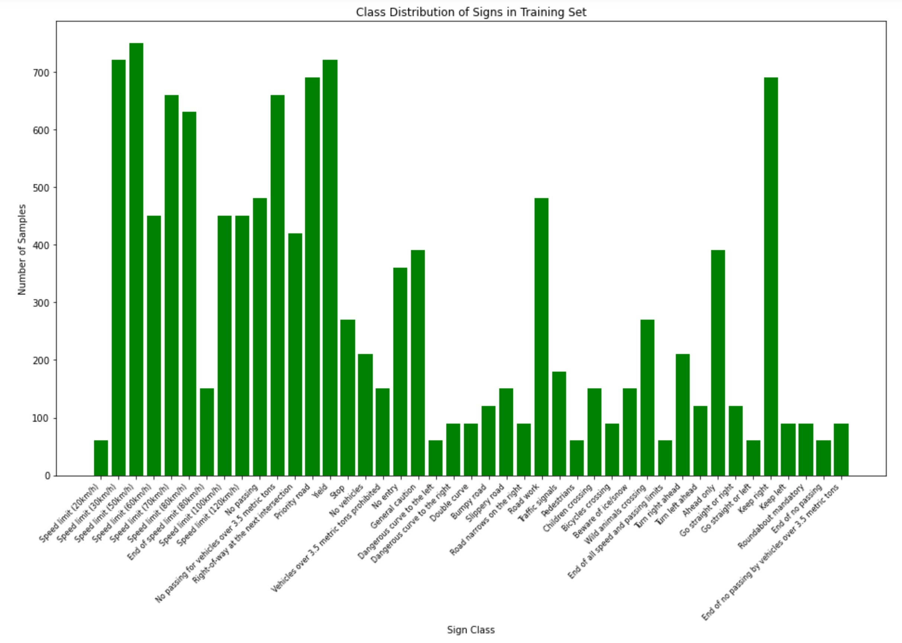

The peaks and troughs in the training distributions will need to be addressed as the classes are severely imbalanced. This imbalance will likely affect the classification accuracy of the model causing it to overfit.

## Design and Test a Model Architecture

### 1. Describe how you preprocessed the image data. What techniques were chosen and why did you choose these techniques? Consider including images showing the output of each preprocessing technique. Pre-processing refers to techniques such as converting to grayscale, normalization, etc.

As a first step, I decided to convert the images from RGB to grayscale. This makes the classifier colour invariant, reduces memory utilisation and significantly reduces the training time for the model.

Here is a preview of the data set after grayscaling:

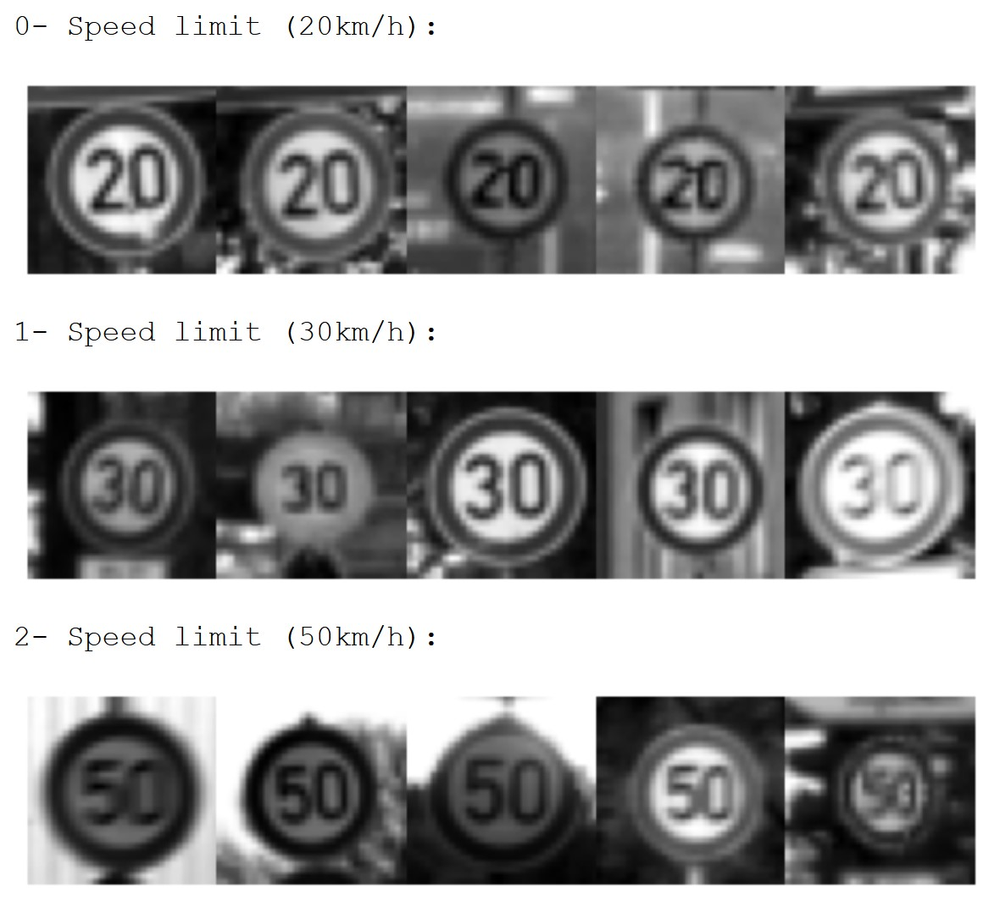

Next, I rescaled the data so that all images have a standard scale of pixel intensity. The linear transform used for the normalisation was **(pixel - 128) / 128** changing the pixel range to between -1 and 1. The data doesn't quite have zero mean but it is pretty close. 

The benefits of rescaling include:

* **Numerical Stability:** Standardising the values involved in the training of loss functions can ensure there is no information loss when values are too big or small. 
* **Easier optimisation:** Rescaling the data improves optimisation efficiency removing effects such as brightness and contrast

Here is a preview of the data set after rescaling:

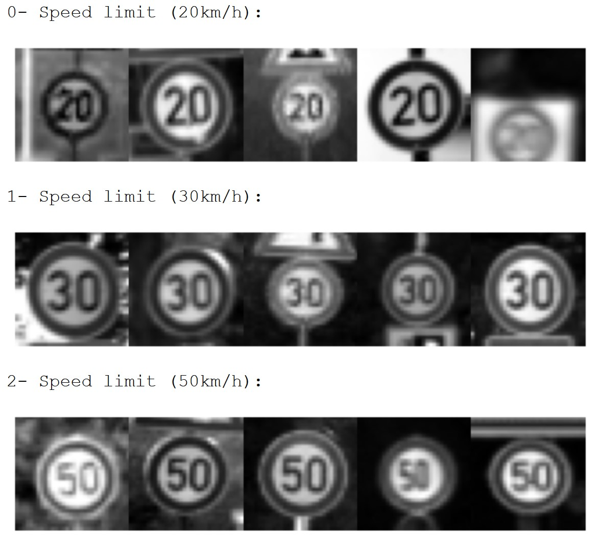

#### Data Augmentation

I decided to generate additional data because there was a clear imbalance in the classes. An imbalanced data set can reduce accuracy by introducing a bias making it easier to overfit on the more frequent classes.

To add more data to the the data set, I used the following techniques because they alter the image slightly to simulate images taken in various conditions (e.g. lighting, viewing angle etc.). A pipeline was created applying the methods: `crop`, `translate`, `rotate`, `scale` and `brightness` with random parameters to an image. Conservative parameters were chosen after manual testing by iterating over the images multiple times. 

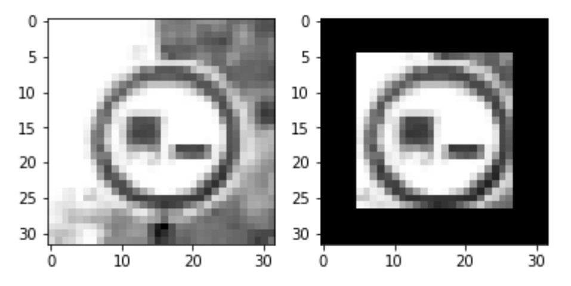

Crop

 

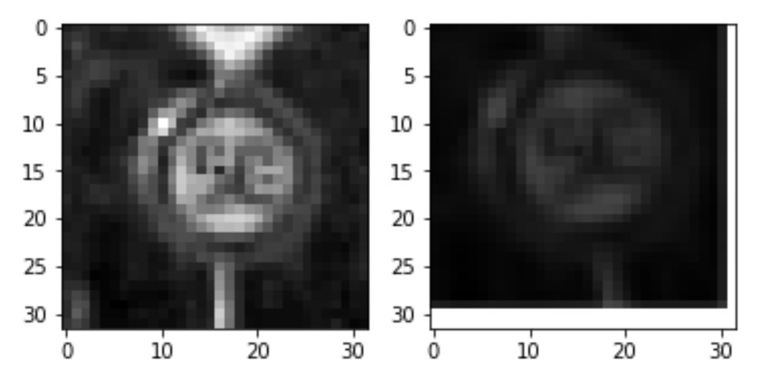

Affine (Rotate, Translate, Scale)

 

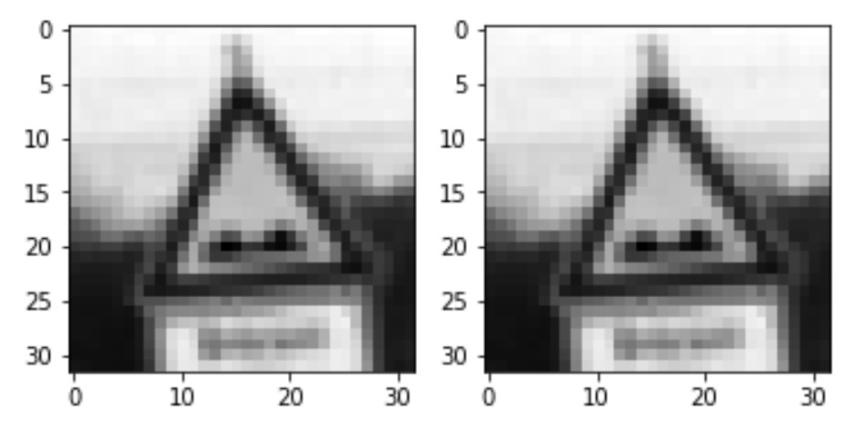

Brightness

 

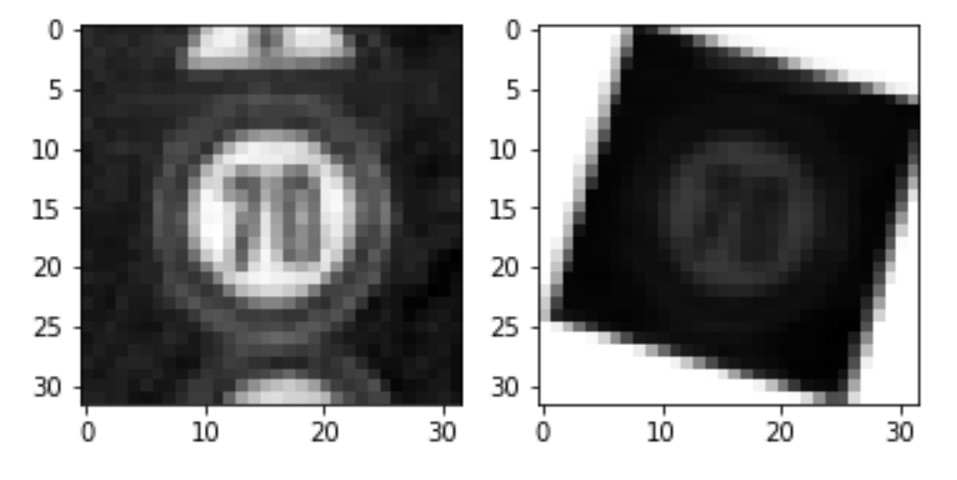

All of the above combined

 

An arbitrary number of 1200 was chosen as the baseline for the number of signs in a class. For each class with fewer signs, the appropriate amount of new images were generated and added to the training data. 

Here is a preview of the original and augmented images:

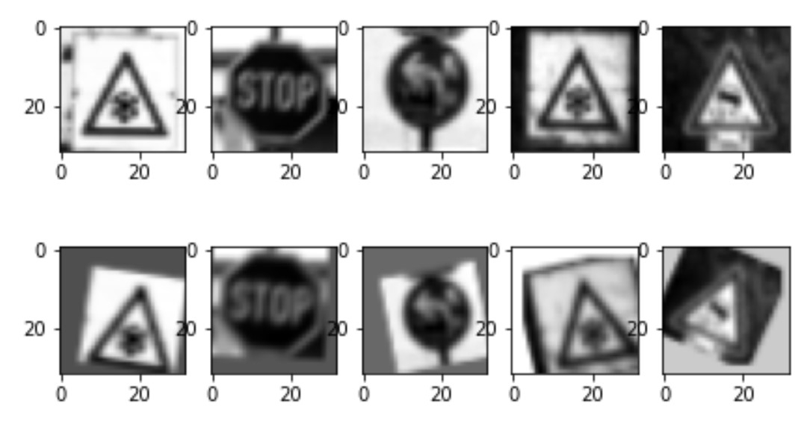

After data augmentation, the training data distribution is as follows:

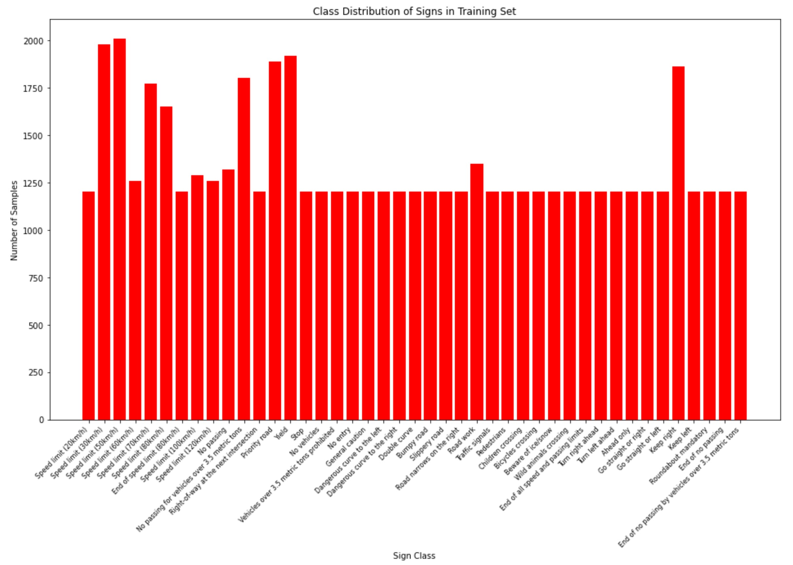

### 2. Describe what your final model architecture looks like including model type, layers, layer sizes, connectivity, etc.) Consider including a diagram and/or table describing the final model.

My final model consisted of the following layers:

| Layer         		|     Description	        					| 
|:---------------------:|:---------------------------------------------:| 
| Input         		| 32x32x1 grayscale image   					| 
| 1: Convolution 5x5    | 1x1 stride, same padding, outputs 28x28x6 	|
| RELU					| 												|
| Max pooling	      	| 2x2 stride, outputs 14x14x6 				    |
|                       |                                               |
| 2: Convolution 5x5    | 1x1 stride, same padding, outputs 10x10x16 	|
| RELU					| 												|
| Max pooling	      	| 2x2 stride, outputs 5x5x16 				    |
|                       |                                               |
| 3: Convolution 5x5    | 1x1 stride, same padding, outputs 1x1x400 	|
| RELU					| 												|
|                       |                                               |
| Flatten               | Input = 1x1x400. Output = 400				    |
| Flatten- (2) branched	| Input = 5x5x16. Output = 400				    |
| Concatenate           | Output = 800                                  |
|                       |                                               |
| Dropout(0.5)          |                                               |
| 1: Fully connected    | Input = 800. Output = 400                     |
| Dropout(0.5)          |                                               |
| 2: Fully connected    | Input = 400. Output = 43                      |
|						|												|

The initial architecture resembled that of LeNet which gave a validation accuracy of 90.4% with default hyperparameters. This was modified to resemble the 2-stage ConvNet by [Sherman and LeCun](http://yann.lecun.com/exdb/publis/pdf/sermanet-ijcnn-11.pdf). The idea is to have a branched layer that is fed to the classifier directly in conjunction with a high-level layer. This allows the classifier to also make use of low-level features with precise details to aid in training.  

Through iterative development and testing, it was extended to 3 convolution layers followed by 2 fully connected layers with dropout.

### 3. Describe how you trained your model. The discussion can include the type of optimizer, the batch size, number of epochs and any hyperparameters such as learning rate.

Training the model involves calculating and minimising the cross-entropy of the logits returned from the neural network. This is done as follows:

1. Convert logits vector to probabilities vector by using the `softmax` function
2. Calculate the `cross-entropy` by matching the predicted probabilities with the one-hot encoded target labels. The cross-entropy is the sum of the negative logs of each probability. 
3. Average across all training images to define the `loss` function.
4. Minimise the loss function using the `Adam` optimiser, which is similar to stochastic gradient descent, by backpropogating the errors over the network. The initial `learning rate` for the optimiser was set to 0.001.

In addition to the above, L2 regularisation and dropout techniques were implemented to improve accuracy.
* **L2 regularisation** prevents overfitting by penalising large weights to reduce their effect. The associated hyperparameter `lambda` was set to an initial value of 0.001.
* **Dropout** also reduces overfitting by temporarily dropping nodes in the network forcing the network to learn redundant representations. The associated hyperparameter `keep_prob` was set to an initial value of 0.5.

The training was done using mini-batching to reduce computational load in loading the whole training data set into memory at once. The initial `batch size` was 128. `Epochs` were used to improve the accuracy by repeating over the data set multiple times. The initial value was set to 10.

### 4. Describe the approach taken for finding a solution and getting the validation set accuracy to be at least 0.93. Include in the discussion the results on the training, validation and test sets and where in the code these were calculated. Your approach may have been an iterative process, in which case, outline the steps you took to get to the final solution and why you chose those steps. Perhaps your solution involved an already well known implementation or architecture. In this case, discuss why you think the architecture is suitable for the current problem.

My final model results were:
* training set accuracy of 99.8%
* validation set accuracy of 97.4% 
* test set accuracy of 95.1%
 
I started off using the LeNet architecture as it is suitable for classifying images returning modest results. The initial architecture was limited to ~90% validation accuracy. The architecture was then modified to resemble the Sermanet & LeCun model as suggested in the exercise which increased the accuracy by ~2%. This architecture was chosen as it was also used for classifying German traffic signs although it could not be cloned due to lack of details in the paper. There are not a lot of complex features in the traffic signs so I opted to keep to three convolution layers for feature extraction.

Subsequently, I implemented some regularisation such as dropout layers and L2 norm to counter the effects of overfitting. This effect was further reduced by implementing data augmentation to balance the data set improving the accuracy further. Further tuning of the hyperparameters led to an improvement in accuray up to 97%. I found that tuning epochs and learning rate had the greatest effect on the accuracy.

I also dabbled a little in adding more fully connected layers with dropouts in between but this did not affect accuracy much and I settled on a single layer for each.

## Test a Model on New Images

### 1. Choose five German traffic signs found on the web and provide them in the report. For each image, discuss what quality or qualities might be difficult to classify.

Here are seven German traffic signs that I found on the web:

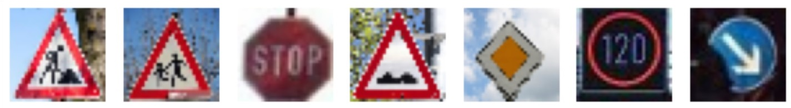

Although these images have some background which could affect their classification, they take up a large portion of the image space so shouldn't be difficult to classify. All of the images seem similar to the images in the dataset except for the `120 km speed limit` sign which is different from those the model has been trained on. I suspect this may cause difficulties for classification.

### 2. Discuss the model's predictions on these new traffic signs and compare the results to predicting on the test set. At a minimum, discuss what the predictions were, the accuracy on these new predictions, and compare the accuracy to the accuracy on the test set (OPTIONAL: Discuss the results in more detail as described in the "Stand Out Suggestions" part of the rubric).

Here are the results of the prediction:

| Image			        |     Prediction	        					| 
|:---------------------:|:---------------------------------------------:| 
| Road work      		| Road work   									| 
| Children crossing     | Children crossing 							|
| Stop					| Stop											|
| Bumpy road	        | Bumpy road					 				|
| Priority road			| Priority road      							|
| Speed limit (120km/h)	| Stop     							            |
| Keep right	        | Keep right     							    |
  

The model was able to correctly guess 6 of the 7 traffic signs, which gives an accuracy of **85.71%**. Although lower than the accuracy of the test set, it is not directly comparable since the sample sizes are vastly different. 

The speed limit sign being misclassified as a stop sign indicates that the model is possibly weighting colour more than the numbers in a given sign. The fact that the second and third guesses for this sign were `20 km limit` and `120 km limit` is evidence of this. This seems reasonable as colour is a better distinguisher in the overall data set compared to numerals due to sheer difference in the number of each. It also indicates that the model may not generalise well to signs (e.g. different colour schemes etc.) beyond what it has been trained on.

### 3. Describe how certain the model is when predicting on each of the five new images by looking at the softmax probabilities for each prediction. Provide the top 5 softmax probabilities for each image along with the sign type of each probability. (OPTIONAL: as described in the "Stand Out Suggestions" part of the rubric, visualizations can also be provided such as bar charts)

The top five soft max probabilities for each image are shown below:

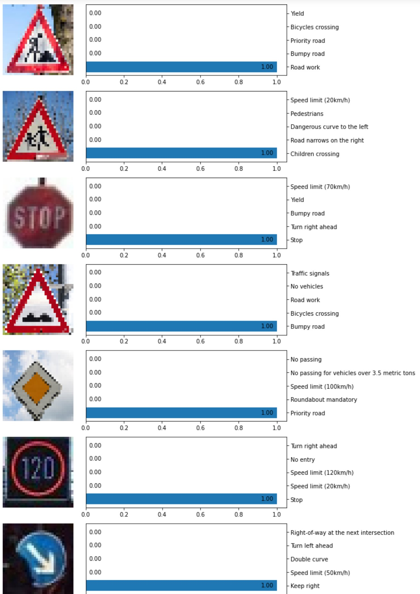

For each image, the model was absolutely certain of its predictions even when wrong which likely means it is overfitting to the data set.
