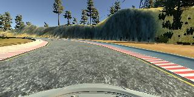
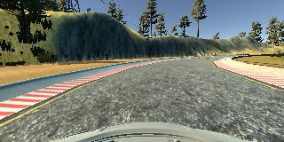
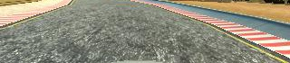

# **Behavioral Cloning** 
---

**Behavioral Cloning Project**

The goals / steps of this project are the following:
* Use the simulator to collect data of good driving behavior
* Build, a convolution neural network in Keras that predicts steering angles from images
* Train and validate the model with a training and validation set
* Test that the model successfully drives around track one without leaving the road
* Summarize the results with a written report

---
### Files Submitted & Code Quality

#### 1. Submission includes all required files and can be used to run the simulator in autonomous mode

My project includes the following files:
* `model.py` containing the script to create and train the model
* `drive.py` for driving the car in autonomous mode
* `model.h5` containing a trained convolution neural network 
* writeup_report.md or writeup_report.pdf summarizing the results

#### 2. Submission includes functional code
Using the Udacity provided [simulator](https://github.com/udacity/self-driving-car-sim) and my `drive.py` file, the car can be driven autonomously around the track by executing 
```sh
python drive.py model.h5
```

#### 3. Submission code is usable and readable

The `model.py` file contains the code for training and saving the convolution neural network. The file shows the pipeline I used for training and validating the model, and it contains comments to explain how the code works.

### Model Architecture and Training Strategy

#### 1. An appropriate model architecture has been employed

My final model is based on the [NVidia End to End Deep Learning](https://developer.nvidia.com/blog/deep-learning-self-driving-cars/) CNN architecture.

The architecture was chosen for its commercial success in learning to steer a car autonomously. The original architecture consists of 9 layers, including a normalization layer, 5 convolutional layers (3: 5x5, 2: 3x3, depths: (24 - 64)), and 3 fully connected layers. The code for the network can be found in the `create_nvidiaNet` method in `model.py` lines 90-114.

I appended a cropping layer to the network to remove distractions and improve training efficiency of the network. The cropping layer gave the best improvement out of all the steps in model tuning allowing the car to progress from the first curve to complete a whole lap! This is followed by the normalisation layer using Keras' lambda layer. Each convolutional layer includes a 2x2 stride to reduce successive feature size as well as a ReLU layer to introduce non-linearity (lines 101-105). 

#### 2. Attempts to reduce overfitting in the model

Overfitting prevention measures include:
* augmentation through flipped images:
* use of auxiliary camera images:

The model contains dropout layers in order to reduce overfitting (`model.py` lines 21). 

The model was trained and validated on different data sets to ensure that the model was not overfitting (code line 10-16). The model was tested by running it through the simulator and ensuring that the vehicle could stay on the track.

#### 3. Model parameter tuning

The model used an adam optimizer, so the learning rate was not tuned manually (`model.py` line 145).

The only other parameter that required tuning was epochs where the optimal value was found to be 5 to prevent overfitting to the training data.

#### 4. Appropriate training data

Training data was chosen to keep the vehicle driving on the road. Although I only used a single lap's worth of data, it contained a combination of center lane driving, recovering from the left and right sides of the road.

For details about how I created the training data, see the next section. 

### Model Architecture and Training Strategy

#### 1. Solution Design Approach

The overall strategy for deriving a model architecture was to start with a basic convolution neural network model architecture such as LeNet with normalisation. I thought this model might be appropriate because it is a generic model used for image classification. However, this did not provide much improvement perhaps because it was too simple.

In order to gauge how well the model was working, I split my image and steering angle data into a training and validation set. I found that my first model had a low mean squared error on the training set but a high mean squared error on the validation set. This implied that the model was overfitting. 

Then I added a cropping layer to mask the relevant area for the network. This resulted in a **significant** improvement as the car successfully completed the track although it did go slightly off track at times.

Upon fixing a bug with the code for importing the images using OpenCV (line 53), the performance surprisingly dropped taking the car off the track after the bridge.

To further improve the driving behavior, the NVidia End to End Deep Learning architecture was implemented. At the end of the process, the vehicle is able to drive autonomously around the track without leaving the road.

#### 2. Final Model Architecture

The final architecture is based on the [NVidia End to End Deep Learning](https://developer.nvidia.com/blog/deep-learning-self-driving-cars/) CNN architecture:

<center></center>
<br>

Not pictured is the cropping layer (`cropping=((70, 20), (0, 0))`) before the normalisation layer. 

#### 3. Creation of the Training Set & Training Process

To capture good driving behavior, I first recorded one lap on track one using center lane driving and some recovery driving. Here is an example image of center lane driving:

<center><br>Center lane driving<br><br></center>

To combat the overfitting, I modified the model so that it took into account augmented data such as flipped images to remove bias towards driving in one direction as well as using the left and right camera images to increase the training data. This allowed the car to reach the first curve before falling off the track. For example, here is an image that has then been flipped:

<center><br>Original<br><br></center>
<center><br>Flipped<br><br></center>

I also cropped the images during model training so that irrelevant information did not affect model training. For example:

<center><br>Original<br><br></center>
<center><br>Cropped<br><br></center>

In the end, I had 6408 number of data points. I finally randomly shuffled the data set and put 20% of the data into a validation set. 

I used this training data for training the model. The validation set helped determine if the model was over or under fitting. The ideal number of epochs was 5 as evidenced by the increased validation error due to overfitting. I used an adam optimizer so that manually training the learning rate wasn't necessary.
