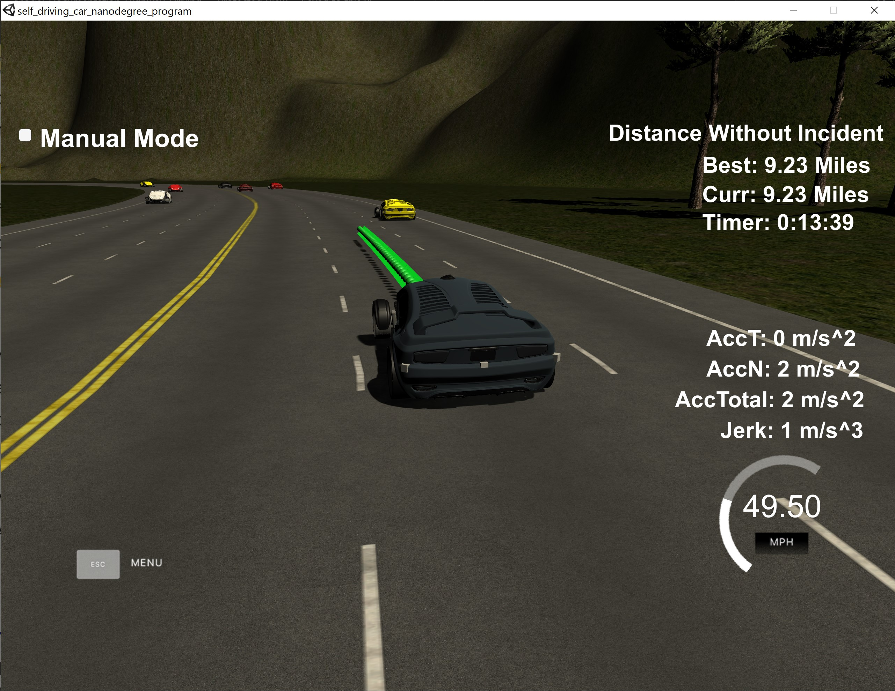

# **Motion Planning**
---

The goal of this project was to design a motion planner that is able to create paths that:
* are smooth, without sudden jerk or acceleration
* adhere to the rules of the road
* avoid collisions with other cars
* stay within the car's lane and on the right-hand side of the highway
* safely change lanes at the appropriate time

It should be able to do the above without incident for at least 4.32 miles.

---

## Overview

A simulator is provided which simulates a car along a 3-lane highway. Also present are other vehicles that are driving at various speeds but below the limit of 50 mph.

<center>

</center>
<br>

In each update cycle, the simulation provides information about the car's state along with sensor fusion data about the vehicles on the same side of the highway.

The task of the planner is to use this information along with a map to continously output a trajectory that can be safely executed by the car in the simulator to mimic driving along the higway.

---

## Input / Output
### Input
The input from the simulator takes the form of a JSON object and consists of:

#### Main car's localization Data (No Noise)

["x"] The car's x position in map coordinates

["y"] The car's y position in map coordinates

["s"] The car's s position in frenet coordinates

["d"] The car's d position in frenet coordinates

["yaw"] The car's yaw angle in the map

["speed"] The car's speed in MPH

#### Previous path data given to the Planner

//Note: Return the previous list but with processed points removed, can be a nice tool to show how far along
the path has processed since last time. 

["previous_path_x"] The previous list of x points previously given to the simulator

["previous_path_y"] The previous list of y points previously given to the simulator

#### Previous path's end s and d values 

["end_path_s"] The previous list's last point's frenet s value

["end_path_d"] The previous list's last point's frenet d value

#### Sensor Fusion Data, a list of all other car's attributes on the same side of the road. (No Noise)

["sensor_fusion"] A 2d vector of cars and then that car's [car's unique ID, car's x position in map coordinates, car's y position in map coordinates, car's x velocity in m/s, car's y velocity in m/s, car's s position in frenet coordinates, car's d position in frenet coordinates. 

### Highway Map
In addition to the data provided by the simulator, the motion planner is also provided a file which contains a map of the highway track. This takes the form of a list of 181 waypoints with the last waypoint wrapping back to the first waypoint.

The track is 6945.554 meters long (about 4.32 miles) so a car averaging near 50 MPH should take a little more than 5 minutes to perform a lap. 

#### Waypoint Data
Each waypoint consists of:

["x"] x map coordinate

["y"] y map coordinate

["s"] distance along the direction of the road

["d"] vector with magnitude of 1 perpendicular to the road in the driving direction


### Output
### Trajectory

A set of points for the car to reach every 20 ms:

["x"] The car's x position in map coordinates

["y"] The car's y position in map coordinates

---

## Motion planner

The motion planner consists of three steps:

1. Prediction- use sensor fusion data to predict the state of the environment
2. Behaviour Planning- determine maneuvers to plan for
3. Trajectory Planner- generate drivable paths for the selected maneuver

### Prediction
---
This module uses sensor fusion data to predict the state (pose, speed etc.) of the other vehicles relative to the ego car. 

For each detected car, the car's lane, speed and position is determined:

`main.cpp (lines: 120 - 140):`
```cpp
auto other_car = sensor_fusion[i];
// 2. Check and record car lane- assumes 3 lane highway of fixed width
if (other_car[6] <= PathPlanner::kLaneWidth) {
    // Left lane
    car_lane = PathPlanner::kLeft;
} else if (other_car[6] > PathPlanner::kLaneWidth && other_car[6] <= PathPlanner::kLaneWidth*2) {
    // Middle lane
    car_lane = PathPlanner::kMiddle;
} else if (other_car[6] > PathPlanner::kLaneWidth*2 && other_car[6] <= PathPlanner::kLaneWidth*3) {
    // Right lane
    car_lane = PathPlanner::kRight;
}

// 3. Get speed of car and distance
double x_vel = other_car[3];
double y_vel = other_car[4];
double other_s = other_car[5];
double other_vel = sqrt(x_vel*x_vel + y_vel*y_vel);

// 4. Project car's s into future proportionally to previous path length
other_s += ((double) prev_path_size * other_vel * PathPlanner::kTimeStep);
```

#### Safe Distance
Based on the predicted state of other cars, distance from the ego car to a car in the same lane is also checked to maintain a safe distance and avoid collisions:

`main.cpp (lines: 142 - 151):`
```cpp
// 5. Check lane of the car and within a certain range e.g. 30m
bool within_safe_gap =  abs(other_s - car_s) < PathPlanner::kSafetyGap;
// Check car ahead in same lane within hotzone
if (car_lane == PathPlanner::lane && other_s > car_s && within_safe_gap) {
    // i. Raise flag to reduce speed to avoid collision
    too_close = true;
    // ii. Raise flag to prepare to switch lanes
    init_lane_switch = true;
}
```

#### Lane Occupancy
In the event a lane switch is required, the module also predicts which lane has a minimum safety gap available for the ego vehicle to switch to:

`main.cpp (lines: 151 - 157):`
```cpp
if (car_lane == PathPlanner::lane - 1 && within_safe_gap) {
// Car is in the left lane
left_lane_available = false;
} else if (car_lane == PathPlanner::lane + 1 && within_safe_gap) {
// Car is in the right lane
right_lane_available = false;
} 
```

### Behaviour Planning
---
This module takes the predictions made above and uses them to guide the vehicle behaviour.

#### Physical Limits
It ensures the vehicle drives according to the law of physics (i.e. exhibits smooth driving with minimal jerk (<10m/s^3) and acceleration (<10m/s^2)) and remains within the highway speed limit of 50 mph:

`config.hpp (lines: 25 - 26):`
```cpp
double max_speed = 49.5 / 2.24;
double max_accel = 0.224;
```

`main.cpp (lines: 164 - 166):`
```cpp
if (PathPlanner::curr_speed < PathPlanner::max_speed) {
    PathPlanner::curr_speed += PathPlanner::max_accel;
}
```

#### Collision Avoidance
If the ego vehicle is too close to a vehicle in front, it reduces speed to maintain distance and avoid a collision:

`main.cpp (lines: 162 - 164):`
```cpp
if (too_close) {
    PathPlanner::curr_speed -= PathPlanner::max_accel;
}
```

#### Lane Switching
When obstructed by a car in front, the ego vehicle will attempt to switch lanes if the conditions are met. Namely, if there is a lane available on either side with sufficient gap to make the switch:

`main.cpp (lines: 168 - 181):`
```cpp
// 7. Switch lanes if available and sufficient gap
if (init_lane_switch) {
    // If not in left lane and space available
    if (PathPlanner::lane > PathPlanner::kLeft && left_lane_available) {
        // std::cout << "Lane switched from " << lane << " to ";
        --PathPlanner::lane;
        // std::cout << lane << std::endl;
    } else if (PathPlanner::lane < PathPlanner::kRight && right_lane_available) {
        // If not in right lane and space available
        // std::cout << "Lane switched from " << lane << " to ";
        ++PathPlanner::lane;
        // std::cout << lane << std::endl;
    }
}
```

If there is no obstruction, the default behaviour is to continue to follow the current lane.

### Trajectory Planner
---
Given the current position and desired behaviour as determined by the behaviour module, the trajectory planner creates a smooth trajectory using splines.

#### Previous Path Points
The simulator runs a cycle every 20 ms (50 frames per second) but a new path is always provided with one cycle latency. The planner can't receive and send data simultaneously.

To ensure a smooth transition between frames, unexecuted path points from the previous cycle are returned by the simulator and used as the starting point for the next trajectory:

`main.cpp (lines: 186 - 191):`
```cpp
// Fill up the next path points with leftover previous path points
// auto prev_path_size = previous_path_si;
for (auto i=0; i<prev_path_size; ++i) {
    next_x_vals.push_back(previous_path_x[i]);
    next_y_vals.push_back(previous_path_y[i]);
}
```

#### Waypoint Generation
The start of the next trajectory is the end of the previous path. If there is no previous path, the previous path is extrapolated from the current state of the ego vehicle (`main.cpp (lines: 201 - 225)`).

Frenet coordinates are used to calculate the waypoints in the trajectory as they make it easier to keep the car in the middle of the lane. They are converted to x-y coordinates for creating the trajectory:

`main.cpp (lines: 227 - 232):`
```cpp
// 4. In Frenet, add 30m-spaced waypoints ahead of current state. Store as waypoints in cartesian
for (auto i=0; i<2; ++i) {
    vector<double> w = getXY(car_s+(i+1)*PathPlanner::kHorizonDistance, 2 + PathPlanner::kLaneWidth*PathPlanner::lane, map_waypoints_s, map_waypoints_x, map_waypoints_y);
    xpts.push_back(w[0]);
    ypts.push_back(w[1]);
}
```

#### Spline Generation
The generated waypoints are used as spline points to initialise a spline. 

`main.cpp (lines: 244):`
```cpp
tk::spline s(xpts,ypts);
```

The spline is then used to generate break points that form the trajectory. Based on the horizon distance considered for the trajectory, the number of break points to use in the trajectory is calculated using Pythagoras' theorem:

`main.cpp (lines: 246 - 253):`
```cpp
// 7. Calculate number of break points in spline to travel at desired speed
double tgt_x = PathPlanner::kHorizonDistance;
double tgt_y = s(tgt_x);
double distance = sqrt(tgt_x*tgt_x + tgt_y*tgt_y);

// b. Break points, N, is N = distance / 0.02 * speed
double N = distance / (PathPlanner::kTimeStep * PathPlanner::curr_speed);
double x_inc = tgt_x / N;
```

The spline is evaluated at these points to form the trajectory:

`main.cpp (lines: 255 - 275):`
```cpp
// 8. Fill up the rest of the next path points using the spline
double next_x, next_y;
for (auto i=1; i <= 50-prev_path_size; ++i) {
// a. Generate x and y spline points
next_x = i * x_inc;
next_y = s(next_x);

// b. Transform back to global frame
double next_x_ref = next_x;
double next_y_ref = next_y;

next_x = next_x_ref * cos(ref_yaw) - next_y_ref * sin(ref_yaw);
next_y = next_x_ref * sin(ref_yaw) + next_y_ref * cos(ref_yaw);

next_x += ref_x;
next_y += ref_y;

// c. Add to next path points
next_x_vals.push_back(next_x);
next_y_vals.push_back(next_y);
}
```

The generated points form the trajectory and are sent to the simulator to execute on the ego vehicle.

## Result
---
The result of the motion planner can be seen in the accompanying [video](./output_vids/motion_planning.mp4).